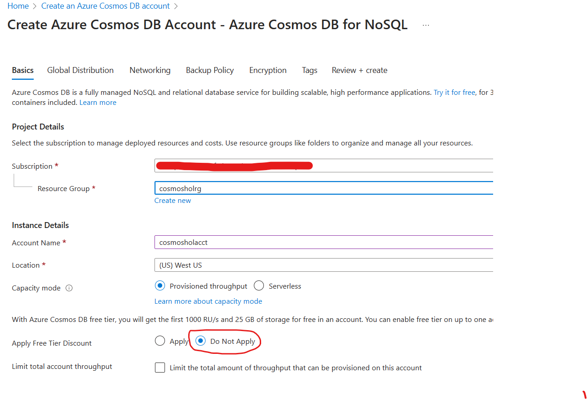

# Module 01 - Create an Azure Cosmos DB account

[< Previous Module](../README.md) - **[Home](../README.md)** - [Next Module >](../modules/module02a.md)

## :loudspeaker: Introduction

When planning your Azure Cosmos DB you first need to create an account. Next, you need an API from Select API option page.

## :thinking: Prerequisites

* An [Azure account](https://azure.microsoft.com/free/) with an active subscription.
* Your must have permissions to create resources in your Azure subscription.

## :dart: Objectives

Create an Azure Cosmos DB using the Azure portal.

1. Sign in to the [Azure portal](https://portal.azure.com), navigate to the **Home** screen, click **Create a resource**.

      

2. On the New page, search for and select Azure Cosmos DB.

    

3. Select Azure Cosmos DB under Plan and click ## Create.  
    
    
    

4. On the Select API option page, select the Create option within the NoSQL section.

    

5. On the Create Azure Cosmos DB Account page, enter the following information:

    

6. Select Review + create. Once complete, click **Go to resource**.

7. Click on **Overview** and review the details like location etc.

8.  Navigate over to the **Keys** navigation menu option.

## :mortar_board: Knowledge Check

1. Which of the following APIs are supported by Azure Cosmos DB? 

        A) Core (SQL) API 
        B) Cassandra API 
        C) MongoDB API 
        D) All of the above  
        
 2. Which of the following consistency levels are available for an Azure Cosmos DB account? 

        A) Strong 
        B) Bounded staleness 
        C) Session 
        D) All of the above
  
3.  What is the purpose of configuring multiple regions for an Azure Cosmos DB account?

         A) To improve availability and fault tolerance 
         B) To reduce the cost of the account 
         C) To increase the maximum storage capacity of the account 
         D) None of the above
 
4. Which pricing tier of an Azure Cosmos DB account provides the highest level of performance and the most advanced features?

        A) Free tier 
        B) Standard tier 
        C) Premium tier 
        D) There is no difference in performance and features between the pricing tiers.

[Continue >](../modules/module02a.md)
