# Module 01 - Create an Azure Cosmos DB account

[< Previous Module](../modules/module00.md) - **[Home](../README.md)** - [Next Module >](../modules/module02a.md)

## :loudspeaker: Introduction

When planning your Azure Cosmos DB you first need to create an account. Next, you need an API from Select API option page.

## :thinking: Prerequisites

* An [Azure account](https://azure.microsoft.com/free/) with an active subscription.
* Your must have permissions to create resources in your Azure subscription.

## :dart: Objectives

Create an Azure Cosmos DB using the Azure portal.

1. Sign in to the [Azure portal](https://portal.azure.com), navigate to the **Home** screen, click **Create a resource**.

    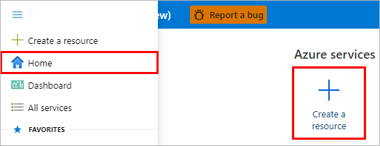  

2. On the New page, search for and select Azure Cosmos DB.

    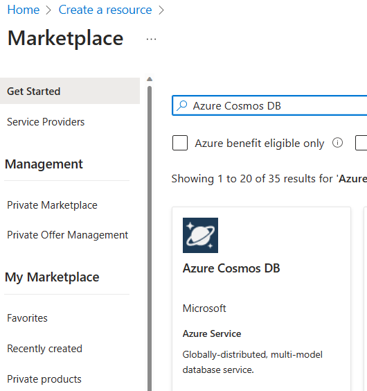

3. Select Azure Cosmos DB under Plan and click ## Create.  
    
    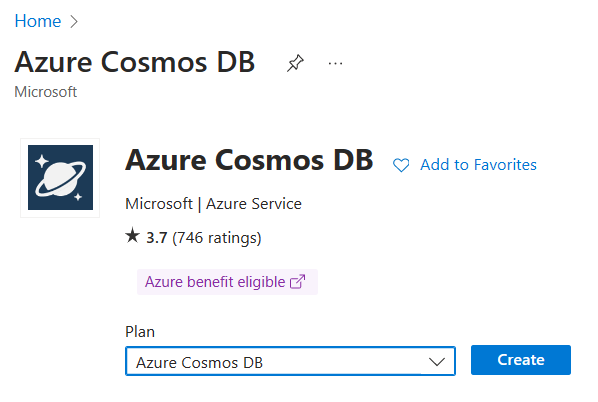
    

4. On the Select API option page, select the Create option within the NoSQL section.

    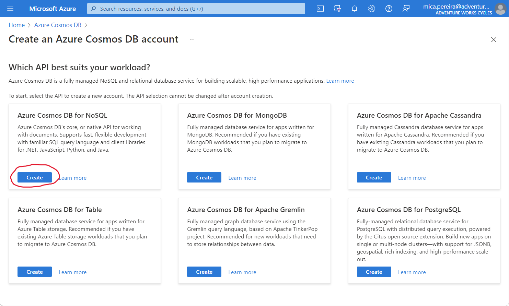

5. On the Create Azure Cosmos DB Account page, enter the following information:

    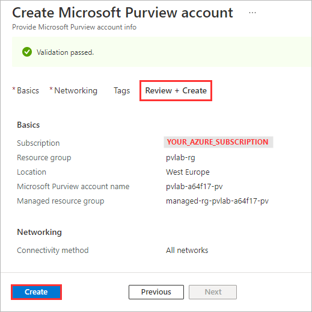

6. Wait several minutes while your deployment is in progress. Once complete, click **Go to resource**.

    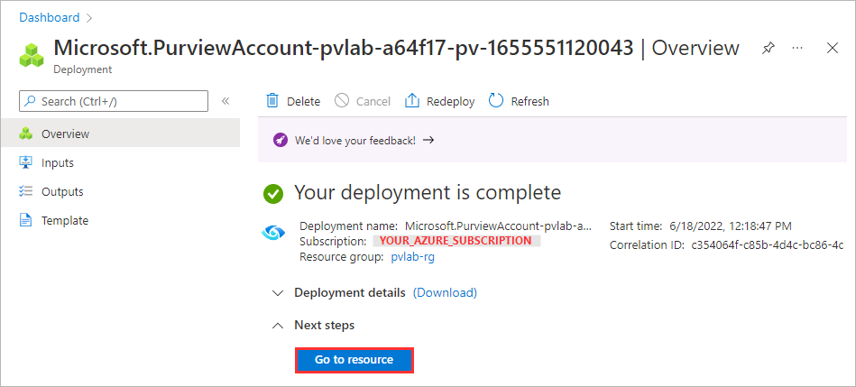

<a href="#module-01---create-a-microsoft-purview-account">↥ back to top</a>

## 2. Grant Access to Microsoft Purview's Data Plane

By default, the identity used to create the Microsoft Purview account resource will have full access to the Microsoft Purview Governance Portal. The following instructions detail how to provide access to additional users within your Azure Active Directory.

1. Navigate to your Microsoft Purview account and click the **Open Microsoft Purview Governance Portal** tile.

    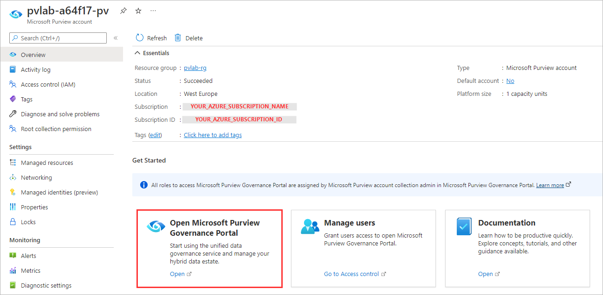

2. On the left-hand side, navigate to **Data map**.

    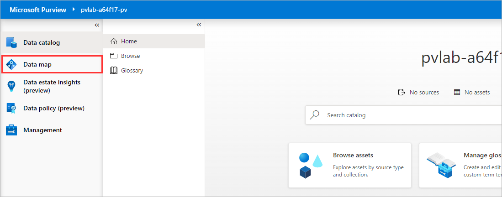

3. Select **Collections**.

    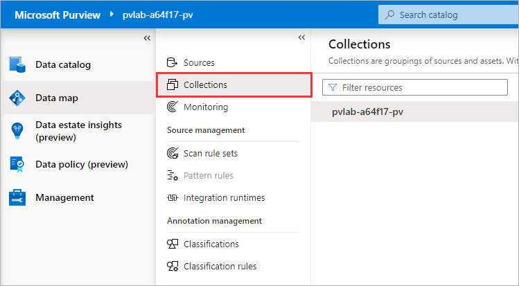

4. Select **Role assignments**.

    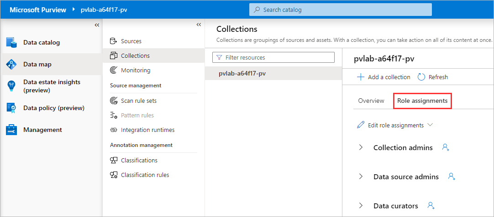

5. On the right-hand side of **Data curators**, click the **Add** icon.

    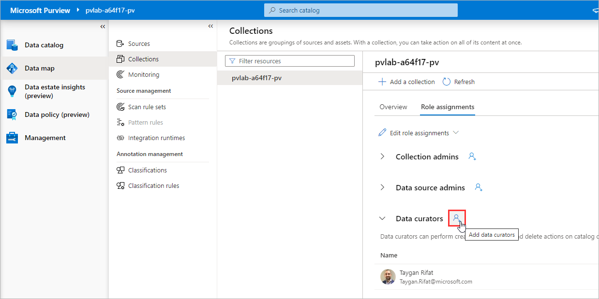

6. Search for another user within your Azure Active Directory, select their account, click **OK**.

    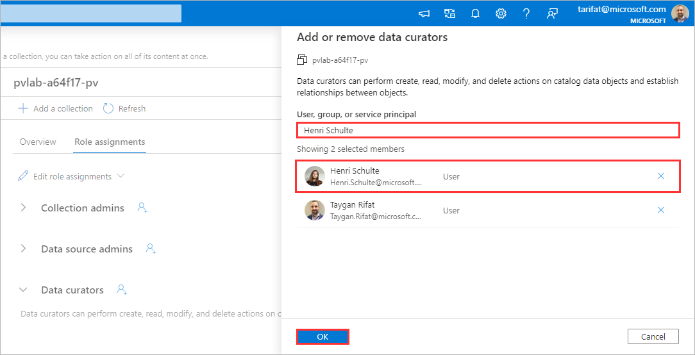

    > :bulb: **Did you know?**
    >
    > Microsoft Purview has a set of predefined data plane roles that can be used to control who can access what.
    >
    > For more information, check out [Access control in Microsoft Purview](https://docs.microsoft.com/azure/purview/catalog-permissions).

    | Role  | Collections | Catalog | Sources/Scans | Description |
    | --- | --- | --- | --- | --- |
    | Collection Admin | `Read/Write` | | | Manage collections and role assignments. |
    | Data Reader ||  `Read` |  | Access to catalog (read only). |
    | Data Curator || `Read/Write` |  | Access to catalog (read & write). |
    | Data Source Admin |  || `Read/Write` | Manage data sources and data scans. |

<a href="#module-01---create-a-microsoft-purview-account">↥ back to top</a>

## :mortar_board: Knowledge Check

[https://aka.ms/purviewlab/q01](https://aka.ms/purviewlab/q01)

1. Which of the following Microsoft Purview pricing meters is **serverless** and used to support **data map population** through scanning and ingestion jobs?

    A ) Capacity Units  
    B ) vCore Hours  
    C ) Neither

2. Which of the following Microsoft Purview pricing meters is **always on** and used to support **data map consumption** through capacity and storage?

    A ) Capacity Units  
    B ) vCore Hours  
    C ) Neither

3. Which Microsoft Purview **feature** is included and billed with the consumption of the **data map**?

    A ) Data Estate Insights  
    B ) Search and browse of data assets  
    C ) SQL DevOps access

4. Which predefined Microsoft Purview role provides access to **manage data sources**?

    A ) Purview Data Reader  
    B ) Purview Data Curator  
    C ) Purview Data Source Administrator

<a href="#module-01---create-a-microsoft-purview-account">↥ back to top</a>

## :tada: Summary

This module provided an overview of how to provision a Microsoft Purview account using the Azure Portal and how to grant the appropriate level of access to Microsoft Purview's data plane.

[Continue >](../modules/module02a.md)
