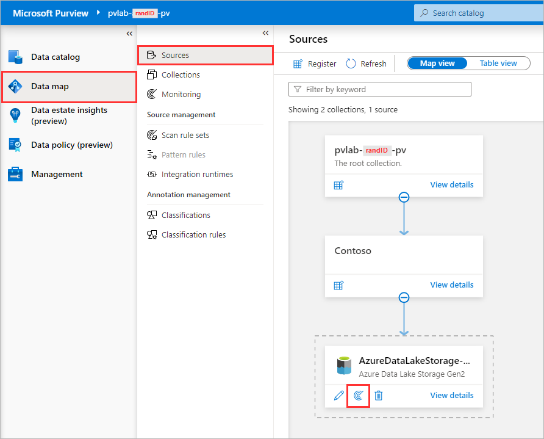
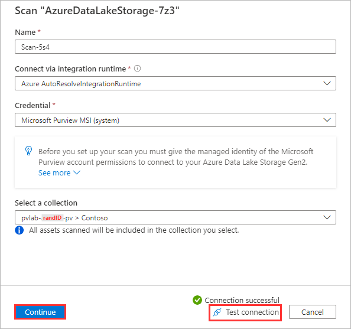
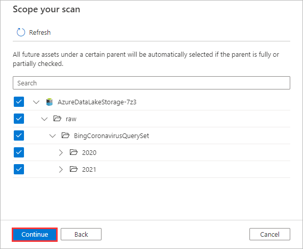
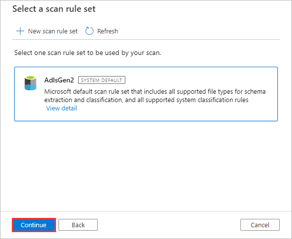
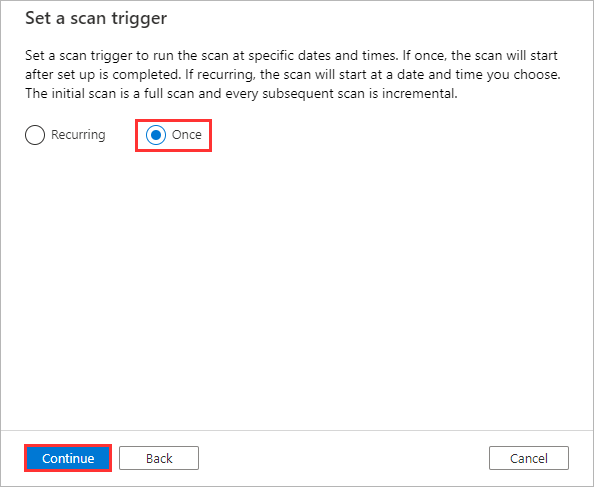
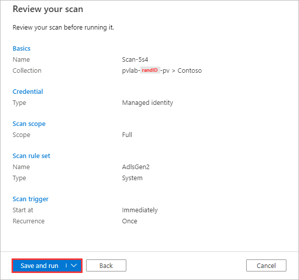
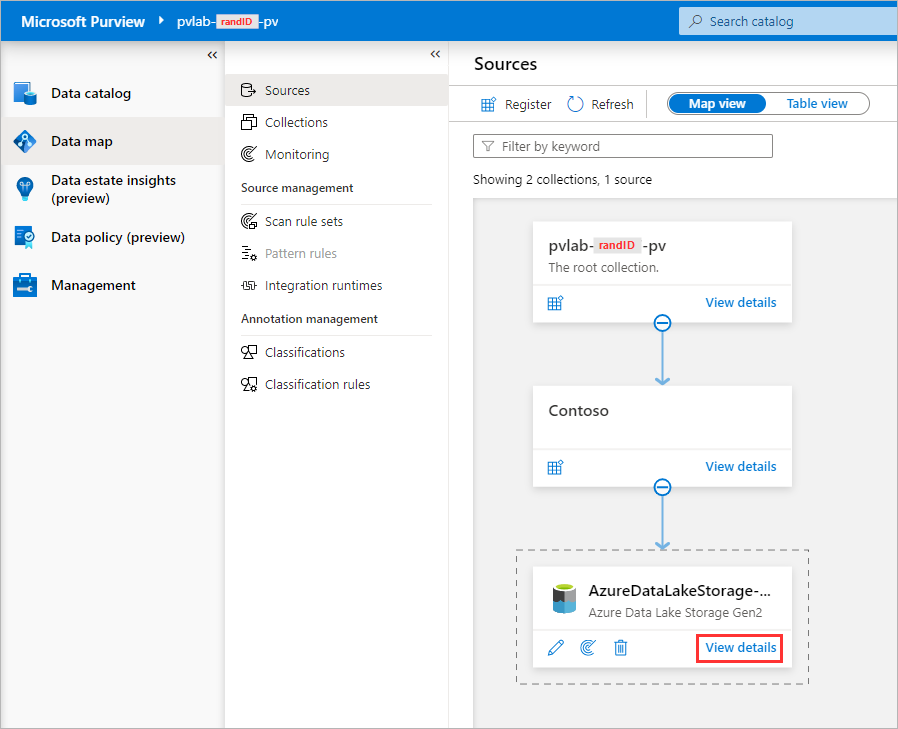
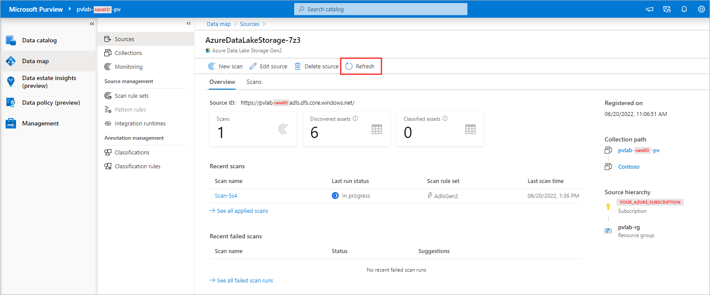
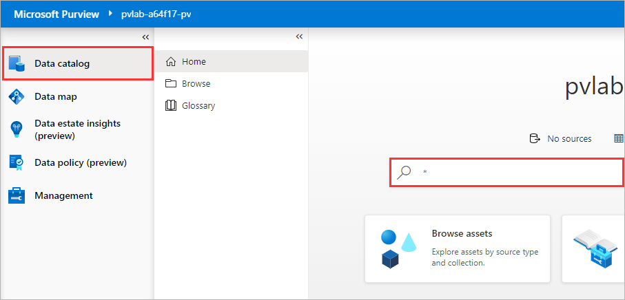
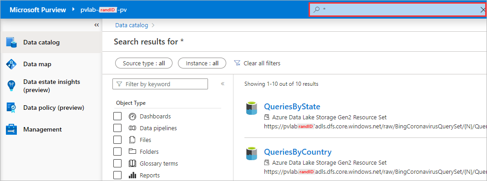

# Module 02 - Create a Container

[< Previous Module](../modules/module01.md) - **[Home](../README.md)** - [Next Module >](../modules/module02b.md)

## :loudspeaker: Introduction

An Azure Cosmos DB container is where data is stored. Unlike most relational databases which scale up with larger VM sizes, Azure Cosmos DB scales out. Data is stored on one or more servers, called partitions. To increase throughput or storage, more partitions are added. This provides a virtually an unlimited amount of throughput and storage for a container. When a container is created, you need to supply a partition key. This is a property you select from your documents to store. The value of that property is then used to route data to the partition to be written, updated, or deleted. It can also be used in the WHERE clause in queries for efficient data retrieval.

## :dart: Objectives

* Create a Container and add documents

> :bulb: **Did you know?**
>
> There are 2 types of partitions Logical and Physical. 
> A logical partition consists of a set of items that have the same partition key. For example, in a container that contains data about food nutrition, all items contain a foodGroup property. The underlying storage mechanism for data in Azure Cosmos DB is called a physical partition.
>   [Partitioning Overview](https://learn.microsoft.com/en-us/azure/cosmos-db/partitioning-overview).
>
>
> In this module we will walk through how to create a container and documents using data explorer.

## 1. Create a container using Azure portal

1. Navigate to Open the Data Explorer pane, and select **Open Full Screen**.

    

2. Select the Subscription and Cosmos DB account that we created earlier.

    

3. click **New Container** from the top left corner, provide the following details. Select **OK**.

    

## 2. Creating Documents from Data Explorer

1. Expand the **Families** and select Items(another name for documents).

2. Select **New Item** from the menu.
    

3. Type in the JSON for my first family. Omit the id when you create a new document. The id property GUID gets generated automatically.

    {
    "familyName": "Smith",
    "address": {
        "addressLine": "123 Main Street",
        "city": "Chicago",
        "state": "IL",
        "zipCode": "60601"
    },
    "parents": [
        "Peter",
        "Alice"
    ],
    "kids": [
        "Adam",
        "Jacqueline",
        "Joshua"
    ]
    }

4. Select **Save** you'll see the id property with a GUID value is created.

## 5. Scan a Source with the Microsoft Purview Managed Identity

1. Open the **Microsoft Purview Governance Portal**, navigate to **Data Map** > **Sources**, and within the Azure Data Lake Storage Gen2 tile, click the **New Scan** button.

    

2. Click **Test connection** to ensure the Microsoft Purview managed identity has the appropriate level of access to read the Azure Data Lake Storage Gen2 account. If successful, click **Continue**.

    

3. Expand the hierarchy to see which assets will be within the scans scope, and click **Continue**.

    

4. Select the system default scan rule set and click **Continue**.

    > :bulb: **Did you know?**
    >
    > [Scan Rule Sets](https://docs.microsoft.com/azure/purview/create-a-scan-rule-set) determine which **File Types** and **Classification Rules** are in scope. If you want to include a custom file type or custom classification rule as part of a scan, a custom scan rule set will need to be created.

    

5. Select **Once** and click **Continue**.

    

6. Click **Save and Run**.

    

7. To monitor the progress of the scan run, click **View Details**.

    

8. Click **Refresh** to periodically update the status of the scan. Note: It will take approximately 5 to 10 minutes to complete.

    

<a href="#module-02a---register--scan-adls-gen2">↥ back to top</a>

## 6. View Assets

1. Navigate to the **Microsoft Purview Governance Portal** > **Data catalog**, and perform a wildcard search by typing the asterisk character (`*`) into the search box and hitting the Enter key to submit the query.

    

2. You should be able to see a list of assets within the search results, which is a result of the scan.

    

<a href="#module-02a---register--scan-adls-gen2">↥ back to top</a>

## :mortar_board: Knowledge Check

[https://aka.ms/purviewlab/q02](https://aka.ms/purviewlab/q02)

1. What type of object can help organize data sources into logical groups?

    A ) Buckets  
    B ) Collections  
    C ) Groups  

2. At which point does Microsoft Purview begin to populate the data map with assets?

    A ) After a Microsoft Purview account is created  
    B ) After a Data Source has been registered  
    C ) After a Data Source has been scanned

3. Which of the following attributes is **not** automatically assigned to an asset as a result of the system-built scanning functionality?

    A ) Technical Metadata (e.g. Fully Qualified Name, Path, Schema, etc)  
    B ) Glossary Terms (e.g. column `Sales Tax` is tagged with the `Sales Tax` glossary term)  
    C ) Classifications (e.g. column `ccnum` is tagged with the `Credit Card Number` classification)  

<a href="#module-02a---register--scan-adls-gen2">↥ back to top</a>

## :tada: Summary

This module provided an overview of how to create a collection, register a source, and trigger a scan.

[Continue >](../modules/module02b.md)
