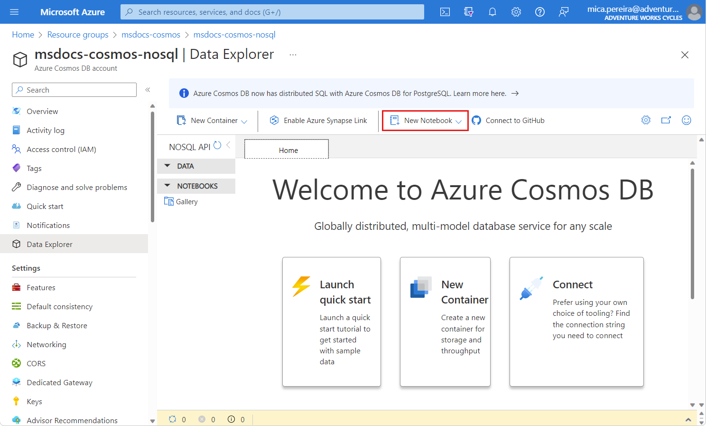
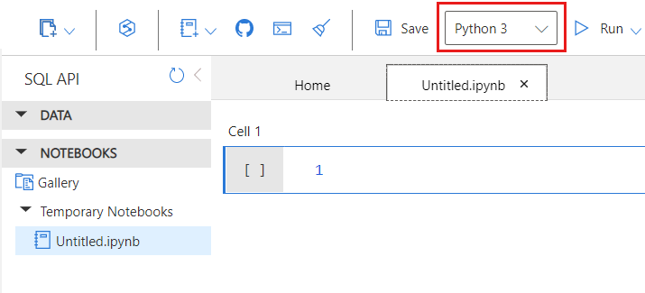

# Module 03 - Using Jupyter Notebooks

[< Previous Module](../modules/module02a.md) - **[Home](../README.md)** - [Next Module >](../modules/module04.md)

## :loudspeaker: Introduction

Jupyter Notebooks is an open-source interactive developer environment (IDE) that's designed to create, execute, and share documents that contain live code, equations, visualizations, and narrative text.

Azure Cosmos DB built-in Jupyter Notebooks are directly integrated into the Azure portal and your Azure Cosmos DB accounts, making them convenient and easy to use. Developers, data scientists, engineers, and analysts can use the familiar Jupyter Notebooks experience to perform common tasks. These common tasks include:

    data exploration
    data cleaning
    data transformations
    numerical simulations
    statistical modeling
    data visualization
    machine learning

## :dart: Objectives

* Search the catalog by keyword.
* Browse the catalog by source.
* Update an existing asset.
* Perform a bulk edit operation.

## 1. Create a new notebook

1. Navigate to your Azure Cosmos DB account and open the Data Explorer.
2. Select **New Notebook**.

    

3. select **Create**.

4. Select the **Python** kernel to use for the notebook.

    

5. Rename the notebook to VisualizeRetailData.ipynb.

## 2. Create a database and container

1. Start in the default code cell.

2. Import any packages you require for this tutorial.

        import azure.cosmos
        from azure.cosmos.partition_key import PartitionKey

3. Create a database named **RetailIngest** using the built-in SDK.

        database = cosmos_client.create_database_if_not_exists('RetailIngest')

4. Create a container named WebsiteMetrics with a partition key of /CartID.

        container = database.create_container_if_not_exists(id='WebsiteMetrics', partition_key=PartitionKey(path='/CartID'))

5. Select **Run** to create the database and container resource.

## 3. Create a database and container

1. Add a new code cell.

2. Within the code cell, add the following magic command to upload.

        %%upload --databaseName RetailIngest --containerName WebsiteMetrics --url https://cosmosnotebooksdata.blob.core.windows.net/notebookdata/websiteData.json

3. Select Run Active Cell to only run the command in this specific cell.

4. Observe the output from the run command. Ensure that 2,654 documents were imported.

> :bulb: **Did you know?**
>
> To save your work permanently, save your notebooks to a GitHub repository or download the notebooks to your local machine before the session ends.

<a href="#module-03---search--browse">↥ back to top</a>

## :mortar_board: Knowledge Check

What is Jupyter Notebook primarily used for?

        a. Web browsing
        b. Writing and executing code
        c. Video editing
        d. Playing games
        
        Answer: b. Writing and executing code

Which of the following is a keyboard shortcut to create a new cell in Jupyter Notebook?

        a. Ctrl + N
        b. Ctrl + Shift + N
        c. Alt + N
        d. Alt + Shift + N

        Answer: b. Ctrl + Shift + N

Which of the following is a keyboard shortcut to run a cell in Jupyter Notebook?

        a. Ctrl + R
        b. Ctrl + Shift + R
        c. Alt + R
        d. Shift + Enter

        Answer: d. Shift + Enter

What is the purpose of using the "magic" command in Jupyter Notebook?

        a. To perform complex mathematical operations
        b. To execute system commands
        c. To change the appearance of the notebook
        d. To create new cells

        Answer: b. To execute system commands

Which of the following is the correct way to install a new package in Jupyter Notebook using pip?

        a. !pip install package_name
        b. !pip -i package_name
        c. !install package_name
        d. !pip package_name

        Answer: a. !pip install package_name

## :tada: Summary

This tutorial walks through how to use the Jupyter Notebooks feature of Azure Cosmos DB.

[Continue >](../modules/module04.md)
