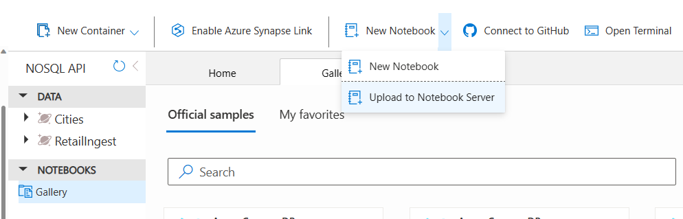
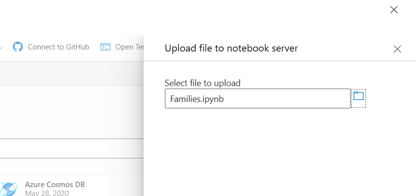
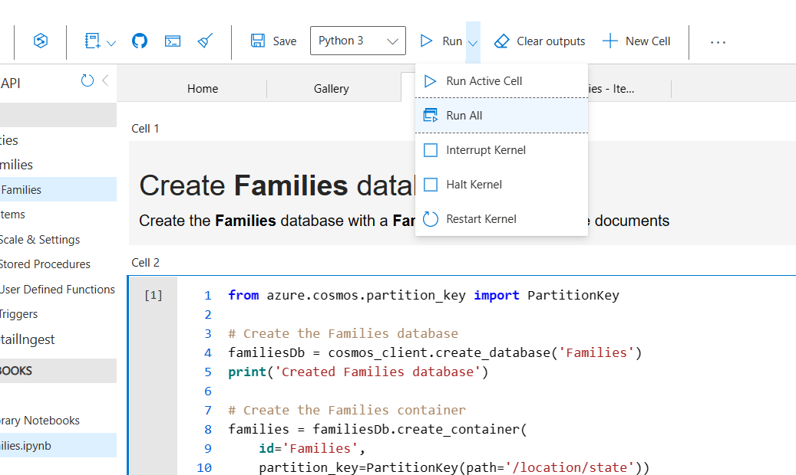

# Module 04 - Writing Queries

[< Previous Module](../modules/module03.md) - **[Home](../README.md)** - [Next Module >](../modules/module05.md)

## :loudspeaker: Introduction

how to query Cosmos DB using this SQL API. The SQL API uses a special version of Structured Query Language that lets you query JSON documents in a container. This version of SQL has some unique syntax designed specifically for the non‑relational world of Cosmos DB. The language still reads as familiar SQL, but is all based on hierarchical JSON documents, not relational tables, and you work with JSON data types, not SQL data types. So you'll see familiar keywords like SELECT, FROM, WHERE, etc. We have to use dotted notation in your queries to navigate a path to any property, no matter how deeply nested it may be within the document. While Cosmos DB doesn't support joins across documents, you can perform what's called an intra‑document join, so you can turn a single document that's got an array of four objects into four separate documents, kind of how an inner join in the relational world turns a single row on the left into as many rows as you join on the right, and your queries can return documents from the database as is, or you can project any custom JSON shape that you want based on as much or as little of the document data that you want. Here's a quick example. At first blush, this looks like a plain, ordinary SQL statement, but when you have a closer look, you can see that it's not. It uses dotted notation to query the state property nested beneath the address property. 

## :thinking: Prerequisites

* An [Azure account](https://azure.microsoft.com/free/) with an active subscription.
* An Azure Data Lake Storage Gen2 Account (see [module 00](../modules/module00.md)).
* A Microsoft Purview account (see [module 01](../modules/module01.md)).

## :hammer: Tools

* [Azure Storage Explorer](https://azure.microsoft.com/features/storage-explorer/)

## :dart: Objectives

* Create a custom classification.
* Trigger a scan that will apply the custom classification to an asset.

## :bookmark_tabs: Table of Contents

| #  | Section  
| --- | ---  
| 1 | [Scalar Expression Queries](#1-Scalar-Expression-Queries)  
| 2 | [Query Operators and Built-in Functions](#2-Query-Operators-and-Built-in-Functions)  
| 3 | [Querying a Container](#3-Querying-a-Container)  
| 4 | [Intra-document Joins](#4-Intra-document-Joins)  
| 5 | [Projections](#5-Projections)  
| 6 | [Search by Classification](#6-search-by-classification)  
| 7 | [Search by Classification](#7-Subset-Filtering)  
| 8 | [Calculated Properties](#8-Calculated-Properties)  
| 9 | [Aggregation Queries](#9-Aggregation-Queries)  

<a href="#module-05---classifications">↥ back to top</a>

## 0. Upload and run a notebook
1. Download the files from  [Downloads](../assests/Module04/)

2. Click on the **Gallery** under **NOTEBOOKS** and select **Upload to a New Server** under **New Notebook**.
 
      

3. Navigate to the notebook location and select the **Families.ipynb**.

    

4. **Run All**.  
    
    
    
## 1. Scalar Expression Queries

Scalar expression queries are a handy way to learn the many capabilities of the SQL dialect in Cosmos DB. These queries don't have a FROM clause, and thus, they don't actually query items in the container, although we technically do need to specify an arbitrary container to submit the query.

Open a new notebook and run these queries on a seperate cells and observe the results. Use the sql magic to run SQL queries.

**%%sql --database Families --container Families**

        SELECT "Hello"
        
        # Use AS to override auto-assigned properties
        SELECT "Hello" AS Greetings
        
        # Use VALUE to return a scalar value instead of an object
        SELECT VALUE "Hello"
        
        
## 2. Query Operators and Built-in Functions

        # Math functions
        SELECT
        ROUND(3.4) AS round34,			ROUND(3.5) AS round35,
        CEILING(3.4) AS ceiling34,		CEILING(3.5) AS ceiling35,
        FLOOR(3.4) AS floor34,			FLOOR(3.5) AS floor35,
        ABS(-5) AS absMinus5,			ABS(5) AS abs5,
        SIN(28) AS sin28,
        COS(28) AS cos28,
        TAN(28) AS tan28,
        LOG(16) AS log16,
        PI() AS pi
         
        # Logical operators
        SELECT
        ("hot" = "cold" AND "up" = "down" OR 1 = 1) AS logical1,
        ("hot" = "cold" AND ("up" = "down" OR 1 = 1) ) AS logical2

        # String functions
        SELECT
        CONCAT("A", "b", "c", "d")	AS strConcat,       CONTAINS("Abcdef", "cde")	AS strContains,
        STARTSWITH("Abcdef", "Ab")	AS strStartsWith,   ENDSWITH("Abcdef", "cdef")	AS strEndsWith,
        INDEX_OF("Abcdef", "de")	AS strIndexOf1,     INDEX_OF("Abcdef", "df")	AS strIndexOf2,
        LEFT("Abcdef", 3)			AS strLeft,         RIGHT("Abcdef", 3)			AS strRight,
        SUBSTRING("Abcdef", 2, 3)	AS strSubstring,    LENGTH("Abcdef")			AS strLength,
        LOWER("Abcdef")			AS strLower,        UPPER("Abcdef")			    AS strUpper

        # Date & Time
        SELECT
        GETCURRENTDATETIME() AS currentUtcDateTime,
        GETCURRENTTIMESTAMP () AS currentUtcTimestamp

## 3. Querying a Container
1. Open a New Query on the container and Highlight each query and observe the results.
        
         SELECT
            c.location.city,
            c.location.state
        FROM
            c

        SELECT
            Families.location.city,
            Families.location.state
        FROM
            Families

        SELECT
            f.location.city,
            f.location.state
        FROM
            Families AS f

        SELECT *
        FROM c.children

        SELECT c.children
        FROM c
        WHERE c.location.state = 'NY'

        SELECT *
        FROM ch IN c.children

        SELECT
            ch.firstName,
            ch.givenName,
            ch.grade,
            ARRAY_LENGTH(ch.pets) AS numberOfPets,
            ch.pets
        FROM
            ch IN c.children

        SELECT
            ch.givenName ?? ch.firstName AS childName,
            ch.grade,
            ARRAY_LENGTH(ch.pets) ?? 0 AS numberOfPets,
            ch.pets ?? [] AS pets
        FROM
            ch IN c.children
        
## 4. Intra-document Joins

        SELECT
            f.id,
            f.location.city,
            f.location.state,
            ch.givenName ?? ch.firstName AS childName,
            ARRAY_LENGTH(ch.pets) ?? 0 AS numberOfPets,
            ch.pets ?? [] AS pets
        FROM
            c AS f
            JOIN ch IN f.children

        SELECT
            f.id,
            ch.givenName ?? ch.firstName AS childName,
            p.givenName AS petName,
            p.type
        FROM
            c AS f
            JOIN ch IN f.children
            JOIN p IN ch.pets

        SELECT p.givenName 
        FROM c AS f
        JOIN ch IN f.children 
        JOIN p IN ch.pets

        SELECT p.givenName 
        FROM c AS f
        JOIN ch IN f.children 
        JOIN p IN ch.pets

        SELECT VALUE p.givenName 
        FROM c AS f
        JOIN ch IN f.children 
        JOIN p IN ch.pets

## 5. Projections

        SELECT c.id, c.name
        FROM c
        
        SELECT VALUE c.name
        FROM c

        SELECT VALUE c.name || ', ' || c.address.countryRegionName
        FROM c

        SELECT
          c.address.countryRegionName AS country,
          {
            "storeName": c.name,
            "cityStateZip": [
                c.address.location.city,
                c.address.location.stateProvinceName
            ],
            "metadata": {
                "internalId": c.id,
                "timestamp": c._ts
            }
          } AS storeInfo
        FROM c

## 6. Range Queries and Sorting

        SELECT c.id, c.address.countryRegionName
        FROM c
        WHERE c.id >= 'A' AND c.id <= 'U'
        
        SELECT c.id, c.address.countryRegionName
        FROM c
        WHERE c.id >= 'A' AND c.id <= 'U'
        
        SELECT c.id, c.address.countryRegionName
        FROM c
        ORDER BY c.id
        
        SELECT TOP 2 c.id, c.address.countryRegionName
        FROM c
        ORDER BY c.id
        
## 7. Subset Filtering

        SELECT l.city
        FROM c.location as l
        WHERE l.city = 'Seattle'

## 8. Calculated Properties

## 9. Aggregation Queries
        SELECT
        COUNT(ch) AS NyKidsCount,
        MIN(ch.grade) AS NyMinGrade,
        MAX(ch.grade) AS NyMaxGrade,
        AVG(ch.grade) AS NyAvgGrade,
        SUM(ARRAY_LENGTH(ch.pets)) AS NyPetsCount
        FROM c JOIN ch IN c.children
        WHERE c.location.state = 'NY' 
        
        SELECT COUNT(c) AS Zip14111Count
        FROM c
        WHERE
        c.address.postalCode = '14111'

1. Once the scan has complete, perform a wildcard search by typing in the asterisk character (**\***) into the search bar and hit Enter.

## :mortar_board: Knowledge Check

[https://aka.ms/purviewlab/q05](https://aka.ms/purviewlab/q05)

1. Which of the following is a valid classification rule type?

    A ) Python  
    B ) Regular Expression  
    C ) C++

2. When creating a regular expression based classification rule, you must specify a Data Pattern **AND** a Column Pattern.

    A ) True  
    B ) False

3. Custom classifications are automatically in scope of a system default scan rule set.

    A ) True  
    B ) False  

<a href="#module-05---classifications">↥ back to top</a>

## :tada: Summary

This module provided an overview of how to create a custom classification, and how to have the classification automatically applied as part of a scan using a custom scan rule set.

[Continue >](../modules/module06.md)
